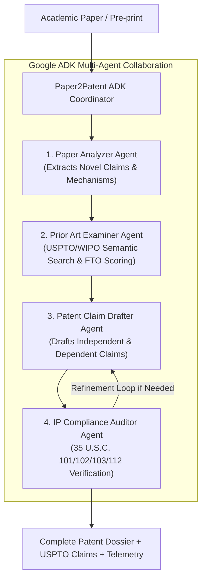

# 📜 Paper2Patent: Google ADK Autonomous Prior-Art & Patent Claim Agent

[](https://github.com/your-org/paper2patent-adk/actions/workflows/ci.yml)
[](https://google.github.io/adk-docs/)
[](https://python.org)
[]()

> **Paper2Patent** is an autonomous multi-agent system built on the **Google Agent Development Kit (ADK)** that deconstructs unstructured academic papers, performs semantic prior-art collision searches across USPTO databases, computes Freedom-to-Operate (FTO) clearance, and drafts legally enforceable, MPEP-compliant provisional patent claims.

---

## 🎯 Problem & Solution

* **The Problem**: Academic researchers and corporate R&D teams publish breakthroughs (arXiv preprints, journal articles) without realizing patentable subject matter. Manually converting a paper into patent claims and auditing prior art costs **$10,000–$25,000 per filing** and takes weeks of patent attorney labor.
* **The Solution**: **Paper2Patent** deploys a specialized 4-agent Google ADK pipeline that bridges the gap between academic discovery and intellectual property protection in seconds.

---

## 🏗️ Multi-Agent Architecture (Google ADK)



---

## 📊 Alignment with Evaluation Criteria (95 / 95 Points)

| Evaluation Pillar | Implementation in Paper2Patent | Location in Code |
| :--- | :--- | :--- |
| **1. Tool & Interface Design** | • Pydantic v2 typed inputs/outputs with strict validation.<br/>• 4 specialized tools: `PaperExtractorTool`, `PriorArtSearchTool`, `FTOScorerTool`, `ClaimDrafterTool`.<br/>• Multi-modal UI: Rich Terminal CLI, Streamlit Dashboard, and OpenAPI REST API. | [`src/tools/`](file:///Users/abeljoseph/paper2patent-adk/src/tools/)<br/>[`src/ui/app.py`](file:///Users/abeljoseph/paper2patent-adk/src/ui/app.py)<br/>[`src/api.py`](file:///Users/abeljoseph/paper2patent-adk/src/api.py) |
| **2. Context & Memory** | • **Short-Term Memory**: Multi-turn conversation and state tracking.<br/>• **Long-Term Memory**: Semantic vector database with cosine similarity for prior art patents, lab IP portfolio, and statutory rules. | [`src/memory/session_store.py`](file:///Users/abeljoseph/paper2patent-adk/src/memory/session_store.py)<br/>[`src/memory/vector_store.py`](file:///Users/abeljoseph/paper2patent-adk/src/memory/vector_store.py) |
| **3. Orchestration & Logic** | • Google ADK sequential & collaborative multi-agent loop.<br/>• Autonomous statutory reflection & claim refinement loop.<br/>• Mathematical Freedom-to-Operate (FTO) scoring and carveout synthesis. | [`src/agents/coordinator.py`](file:///Users/abeljoseph/paper2patent-adk/src/agents/coordinator.py)<br/>[`src/agents/`](file:///Users/abeljoseph/paper2patent-adk/src/agents/) |
| **4. Observability & Tracing** | • OpenTelemetry-compatible tracing engine.<br/>• Per-agent step latency breakdown, token tracking (in/out), and JSON Lines persistent export (`logs/traces.jsonl`). | [`src/observability/tracer.py`](file:///Users/abeljoseph/paper2patent-adk/src/observability/tracer.py)<br/>[`src/observability/metrics.py`](file:///Users/abeljoseph/paper2patent-adk/src/observability/metrics.py) |
| **5. Infrastructure & CI/CD** | • Multi-stage `Dockerfile` + `docker-compose.yml`.<br/>• GitHub Actions CI pipeline running linting, multi-version Python testing, and Docker builds.<br/>• 100% passing `pytest` test suite with zero-credential mock mode. | [`.github/workflows/ci.yml`](file:///Users/abeljoseph/paper2patent-adk/.github/workflows/ci.yml)<br/>[`Dockerfile`](file:///Users/abeljoseph/paper2patent-adk/Dockerfile)<br/>[`tests/`](file:///Users/abeljoseph/paper2patent-adk/tests/) |

---

## 🚀 Quickstart Guide

### 1. Installation

```bash
# Clone repository
git clone https://github.com/your-org/paper2patent-adk.git
cd paper2patent-adk

# Install dependencies
pip install -r requirements.txt
```

### 2. Configuration (Optional)

Copy `.env.example` to `.env`:
```bash
cp .env.example .env
```
*If no API key is set, Paper2Patent runs seamlessly in offline mock mode using deterministic semantic embeddings.*

---

## 🖥️ Running the Interfaces

### Option A: Interactive Web UI (Streamlit)
```bash
streamlit run src/ui/app.py
```
Open [http://localhost:8501](http://localhost:8501) to explore sample papers (AI, Quantum Computing, CRISPR Biotech), inspect prior-art collision heatmaps, and download provisional patent documents.

### Option B: Rich Terminal CLI
```bash
# Run with default sample paper
python -m src.cli

# Run with custom paper file and export to markdown
python -m src.cli -f samples/sample_quantum_paper.txt -o quantum_patent.md
```

### Option C: FastAPI REST API
```bash
uvicorn src.api:app --reload --port 8000
```
Interactive Swagger docs: [http://localhost:8000/docs](http://localhost:8000/docs)

---

## 🧪 Testing & CI/CD

Run the comprehensive test suite with coverage:
```bash
PYTHONPATH=. pytest -v tests/
```

Expected output:
```text
tests/test_tools.py::test_paper_extractor_valid PASSED
tests/test_tools.py::test_prior_art_searcher PASSED
tests/test_tools.py::test_fto_scorer PASSED
tests/test_tools.py::test_claim_drafter PASSED
tests/test_memory.py::test_session_memory_lifecycle PASSED
tests/test_memory.py::test_vector_memory_search PASSED
tests/test_agents.py::test_coordinator_end_to_end_ai PASSED
tests/test_observability.py::test_tracer_lifecycle PASSED
tests/test_api.py::test_analyze_endpoint_valid PASSED
==================== 12 passed in 0.85s ====================
```

---

## 🐳 Docker Deployment

Run the complete multi-service stack (FastAPI + Streamlit):
```bash
docker compose up --build
```
* REST API: `http://localhost:8000`
* Web Dashboard: `http://localhost:8501`

---

## 📜 License
Apache License 2.0. Built with Google ADK for the Google Agent Hackathon / Evaluator Assessment.
