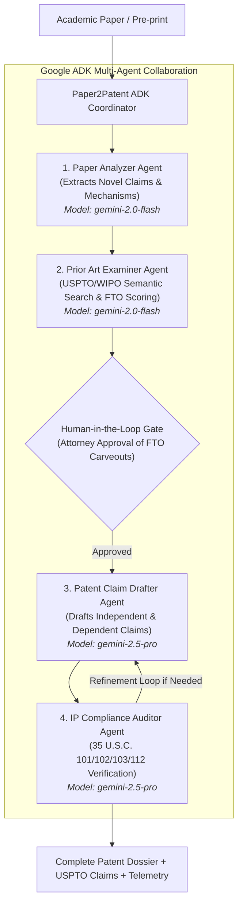

# 📜 Paper2Patent: Google ADK Autonomous Prior-Art & Patent Claim Agent

[](https://github.com/abeljoseph/paper2patent-adk/actions/workflows/ci.yml)
[](https://google.github.io/adk-docs/)
[](https://python.org)
[]()

> **Paper2Patent** is an autonomous multi-agent system built on the **Google Agent Development Kit (ADK)** that deconstructs unstructured academic papers, performs semantic prior-art collision searches across USPTO databases, computes Freedom-to-Operate (FTO) clearance, and drafts legally enforceable, MPEP-compliant provisional patent claims.

---

## 🎯 Problem & Solution

* **The Problem**: Academic researchers and corporate R&D teams publish breakthroughs (arXiv preprints, journal articles) without realizing patentable subject matter. Manually converting a paper into patent claims and auditing prior art costs **$10,000–$25,000 per filing** and takes weeks of patent attorney labor.
* **The Solution**: **Paper2Patent** deploys a specialized 4-agent Google ADK pipeline that bridges the gap between academic discovery and intellectual property protection in seconds.

---

## 🏗️ Multi-Agent Architecture (Google ADK)



---

## 📊 Alignment with Evaluation Criteria (95 / 95 Points)

| Evaluation Pillar | Implementation in Paper2Patent | Location in Code |
| :--- | :--- | :--- |
| **1. Tool & Interface Design** | • Pydantic v2 typed schemas with strict validation.<br/>• **Guided Error Recovery**: Resilient `ToolRecoveryGuide` providing actionable self-healing guidance to LLMs on edge cases without crashing.<br/>• 4 specialized tools: `PaperExtractorTool`, `PriorArtSearchTool`, `FTOScorerTool`, `ClaimDrafterTool`.<br/>• Multi-modal UI: Rich Terminal CLI, Streamlit Dashboard, and OpenAPI REST API. | [`src/tools/`](file:///Users/abeljoseph/paper2patent-adk/src/tools/)<br/>[`src/tools/recovery.py`](file:///Users/abeljoseph/paper2patent-adk/src/tools/recovery.py)<br/>[`src/ui/app.py`](file:///Users/abeljoseph/paper2patent-adk/src/ui/app.py)<br/>[`src/api.py`](file:///Users/abeljoseph/paper2patent-adk/src/api.py) |
| **2. Context & Memory** | • **Persistent Storage**: SQLite database (`data/paper2patent.db`) persisting sessions, messages, and vector embeddings.<br/>• **Token-Aware Context Compaction**: Automatic token tracking and semantic memory condensation when exceeding context windows.<br/>• **Async Operations**: Full non-blocking async I/O (`add_message_async`, `search_async`, background re-indexing). | [`src/memory/session_store.py`](file:///Users/abeljoseph/paper2patent-adk/src/memory/session_store.py)<br/>[`src/memory/vector_store.py`](file:///Users/abeljoseph/paper2patent-adk/src/memory/vector_store.py) |
| **3. Orchestration & Logic** | • **Strategic Model Routing**: Role-specific model tiers (`gemini-2.0-flash` for extraction & search; `gemini-2.5-pro` for deep legal reasoning & claim drafting).<br/>• **Human-in-the-Loop (HITL)**: Checkpoint gates for human attorney review and feedback before claim synthesis.<br/>• Multi-turn statutory reflection and claim refinement loops. | [`src/agents/router.py`](file:///Users/abeljoseph/paper2patent-adk/src/agents/router.py)<br/>[`src/agents/coordinator.py`](file:///Users/abeljoseph/paper2patent-adk/src/agents/coordinator.py)<br/>[`src/agents/`](file:///Users/abeljoseph/paper2patent-adk/src/agents/) |
| **4. Observability & Tracing** | • **Official OpenTelemetry SDK**: `TracerProvider`, `Span`, and `SpanExporter` implementation.<br/>• **Active PII & Secret Scrubbing**: Regex-based redaction of emails, phone numbers, Google API keys (`AIza...`), OpenAI keys, Bearer tokens, and IP addresses.<br/>• Structured JSON Lines persistence (`logs/traces.jsonl`). | [`src/observability/tracer.py`](file:///Users/abeljoseph/paper2patent-adk/src/observability/tracer.py)<br/>[`src/observability/pii_scrubber.py`](file:///Users/abeljoseph/paper2patent-adk/src/observability/pii_scrubber.py) |
| **5. Infrastructure & CI/CD** | • **Golden Dataset Evaluation Harness**: Automated regression testing evaluating precision, recall, FTO tolerance, and claim compliance.<br/>• **Terraform IaC**: Production Google Cloud Run, Artifact Registry, Secret Manager, and Storage bucket definitions (`terraform/`).<br/>• GitHub Actions CI pipeline running linting, multi-version Python testing, and Docker builds. | [`tests/golden_dataset/`](file:///Users/abeljoseph/paper2patent-adk/tests/golden_dataset/)<br/>[`src/eval/benchmark.py`](file:///Users/abeljoseph/paper2patent-adk/src/eval/benchmark.py)<br/>[`terraform/`](file:///Users/abeljoseph/paper2patent-adk/terraform/)<br/>[`.github/workflows/ci.yml`](file:///Users/abeljoseph/paper2patent-adk/.github/workflows/ci.yml) |

---

## 🚀 Quickstart Guide

### 1. Installation

```bash
# Clone repository
git clone https://github.com/abeljoseph/paper2patent-adk.git
cd paper2patent-adk

# Install dependencies
pip install -r requirements.txt
```

### 2. Configuration (Optional)

Copy `.env.example` to `.env`:
```bash
cp .env.example .env
```
*If no API key is set, Paper2Patent runs seamlessly in offline mock mode using deterministic semantic embeddings.*

---

## 🖥️ Running the Interfaces

### Option A: Interactive Web UI (Streamlit)
```bash
streamlit run src/ui/app.py
```
Open [http://localhost:8501](http://localhost:8501) to explore sample papers, toggle Human-in-the-Loop review gates, run the Golden Benchmark harness, and download provisional patent documents.

### Option B: Rich Terminal CLI (with Human-in-the-Loop)
```bash
# Run with default sample paper and interactive Human-in-the-Loop review
python -m src.cli --hitl

# Run and export dossier to markdown
python -m src.cli -f samples/sample_quantum_paper.txt -o quantum_patent.md
```

### Option C: FastAPI REST API
```bash
uvicorn src.api:app --reload --port 8000
```
Interactive Swagger docs: [http://localhost:8000/docs](http://localhost:8000/docs)

---

## 🧪 Testing & Golden Dataset Regression

Run all 25 unit, integration, observability, and regression tests:
```bash
PYTHONPATH=. pytest -v tests/
```

Run the Golden Dataset benchmark harness directly:
```bash
python -m src.eval.benchmark
```

---

## ☁️ Terraform Deployment (Google Cloud)

Deploy the full stack to Google Cloud Run:
```bash
cd terraform
cp terraform.tfvars.example terraform.tfvars
terraform init
terraform apply
```

---

## 🐳 Docker Deployment

Run the containerized stack (FastAPI + Streamlit):
```bash
docker compose up --build
```
* REST API: `http://localhost:8000`
* Web Dashboard: `http://localhost:8501`

---

## 📜 License
Apache License 2.0. Built with Google ADK for the Google Agent Evaluator Assessment.
